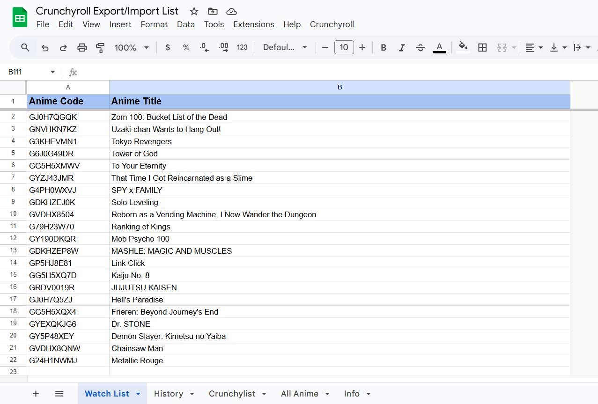

# Crunchyroll-Export-Import-List
A Spreadsheet + Google Apps Script to export/import your Watchlist, Crunchylists and History from your Crunchyroll account and get the full list of Anime available on Crunchyroll with the Dub and Sub language available for each Anime

Spreadsheet with Google Apps Script:

https://docs.google.com/spreadsheets/d/1_1Q0RW8VgaHWQuCZ9zM3johR9vvI99ghYl_rMHNp2Ig/copy

## Usage

### Sheet

There are 5 sheet in the spreadsheet file:

- Watchlist, to export/import your Watchlist
- History, to export/import your History
- Crunchylists, to export/import your CrunchyLists
- All Anime, contains all anime available on Crunchyroll with the Dub and Sub language available (you can filter them by using the sheet filters or by going in the top toolbar Data > Change View and select one of the option)
- Info, contains some info about the spreadsheet

### Run the script

To run the script you can use one of the option in the menu Crunchyroll in the toolbar.

The first time you run the script it will ask for permissions to run:
- "See, edit, create, and delete all your Google Sheets spreadsheets" to edit the spreadsheet file
- "Connect to an external service" to get the data from the Crunchyroll website

For each type of operation you need to use the specific sheet (Example: export watchlist will write in the Watchlist sheet and for import the watchlist you have to use this sheet)
For each operations you need to provide a token that is necessary to export/import all the data in your Crunchyroll profile.

To get the Authentication token, you can follow this step that use the Developer Window of the Browser:

- Go to the Crunchyroll home page:
 
  https://www.crunchyroll.com/

- Right click on the mouse inside the page > select "Inspect"
- Go to the "Network" tab
- Reload the page
- Inisde the Developer tool window that you opened there is a filter bar in the top left
- Search:
  
  https://www.crunchyroll.com/accounts/v1/me
  
- It should give you only 1 result, select it and then in the "Headers" tab there is the section "Request Headers" and under it there is the "Authorization:" tag containing a long string that starts with "Bearer"
- Copy that string (without the empty space at the end) and paste in the sheet pop-up

The token expires after 3 minutes

It could be possible to edit the script and use directly your credentials to avoid the use of the token
